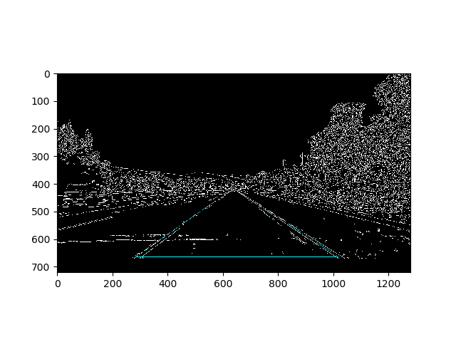
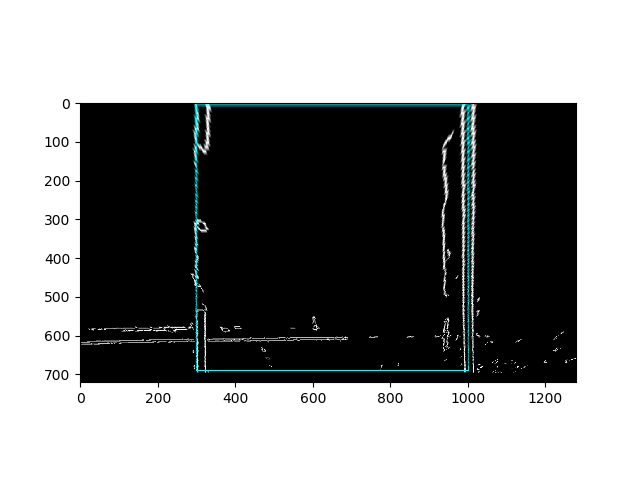
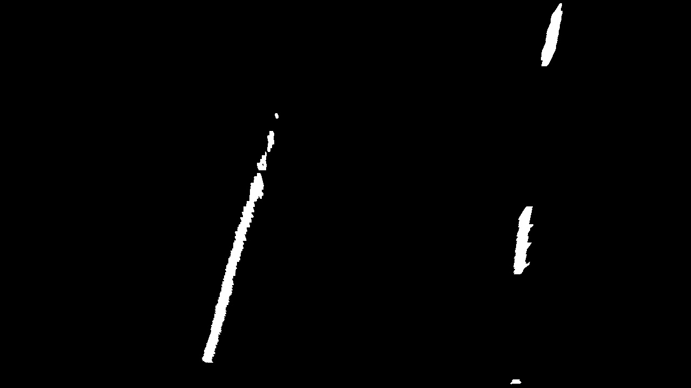
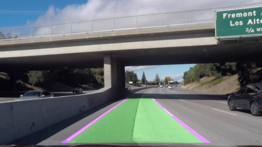
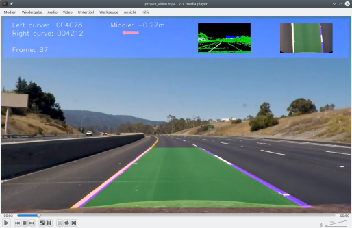
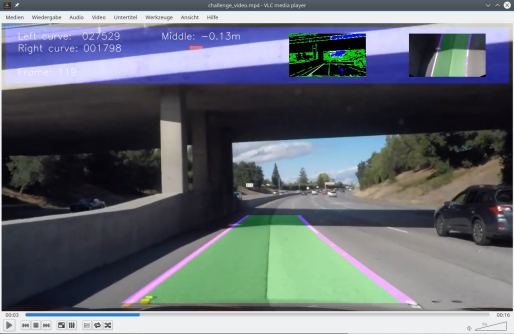
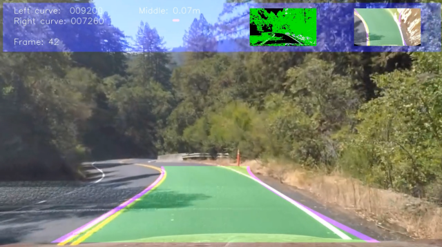

# **Advanced lane finding project**

# Summary

The steps of this project are the following:

* Computation the camera calibration matrix and distortion coefficients from a set of chessboard images.
* Undistortion of raw images
* Image segmentation using colors and edge detection
* Application of perspective transformation to bird's eye view
* Detection of lane pixels and fit to find the lane boundary.
* Determination the curvature of the lane and vehicle position with respect to center.
* Warping the detected lane boundaries back onto the original image.
* Output visual display of the lane boundaries and numerical estimation of lane curvature and vehicle position.
* Processing of videos

# Camera Calibration

## Computation of the camera matrix and distortion coefficients

The camera calibration is done in the class CalibrateCamera in CameraCalibration.py.
To do the calibration, images of chess boards with size (9, 6) are made from different camera positions. These are fed to the OpenCV algorithm `findChessboardCorners()` which finds the corners of the chess board and returns the coordinates in the camera coordinate system.
The world coordinate system is centered at the top left of the chess board and the z coordinates are assumed as zero. Since the chess board size is not know the size of one square is assumed to be 1.0. The length units of the result is then the length of one square.
To calculate the intrinsic camera parameters and the distortion coefficients the OpenCV function `calibrateCamera()` is used. It's called with a list ob objectpoints which is are the chess board corners in the world coodinate system described above and the image points in the camera coordinate system.
The result are the wanted parameters and the rotation and extrinsic parameters which are not used for our purposes.

With the parameters a quick check is done by undistorting one of the images with the OpenCV function `undistort()` and the result is checked:

Right: image with distortions and detected corner
Left: undistorted image

# Detection pipeline

## Visualization of the pipeline

The camera image is first undistorted.

Segmentation is done by a color and canny edge detection. Both boolean images were combined with an "and" operator.
Since the "harder challenge" has frames with lane markings going in all directions no other edge detections algorithm like calculating the direction are used. For easier situations like driving on a highway gradient directions could be used since the lane marks are always in a small range near straight forward.
Combination is done with an "and" operator which gives the best result. "Or" combinations are better in some situations with shadow but can give too many matches in other situations.

The segmented image is then transformed to bird's eye view.

First line matching is done a sliding window approach. From the histogram of the lower image part the start regions are detected. Since lane marks should go straight forwart at least for a shorter range, the maxima of the histogram both on the left and the right side are a good starting point for the sliding window search.
The sliding window algorithm subdivides the image in windows with a configurable height and width. The middle of the first window is at the bottom where the histograms maximum is located. Then all true pixels from the segemented image inside the window are saved as matching points. The average in x direction of these points is set as new middle for the next window.

For following frames the polynomial approximations of the lane marks in the last frame are used for a faster detection. All points in a configurable range in x direction to the polynom are saved as new lane mark points and used for the next fit.

From the polynom the lane curvature and the position of the car relative to the lane center are calculated. A visualization of the detected lane is done.

The visualization of the lane is warped back and merged with the original image.

## Image segmentation

Following the image segmentation is described. The implementation of the different segmentation algorithms is in `ImageSegmentation.py`.

This is the undistorted base image:

### Canny edge detection

Canny edge detection calculates very thin edges. So the edges are dilated to fit better to the color segmentation. It can be seen that edge detection alone can show some curves which can't be easily distinguished from the real lane mark.

### Color segmentation

For color segmentation the image is transformed from RGB to HSL colorspace. White is detected with a threshold of the lightness and yellow with a combination of threshols for hue, lightness and saturation. 

Since the left lines are always yellow and the right lanes are always white in the videos used they are also segmented for the corresponding colors. This helped in the harder challenge to reduce reflections from the window.

Combined segmentation:

Both segmentations were combined using the 'and' operator. This is necessary since there are often object with similar colors to the lane marks. And the roadway surface can have sharp edges, for example in the "challenge" video the left part of the lane was newer than the right and therefore much darker.

## Perspective transformation

The matrices for the perspective transformation were calculated using the OpenCV function `getPerspectiveTransform()`. The source and destination points needed for this algorithm were achieved by manually finding points in an camera image which shows a straight lane. Points from the region which should be used for the lane detection were choosen from the left and right lane mark at the bottom and the top.
Corresponding destination points were choosen by setting the x position for both points on the left and for both points on the right lane mark to the same value.

Since the camera and it's position don't changes in the videos these parameters were hard coded.

This resulted in the following source and destination points:

| Source        | Destination   | 
|:-------------:|:-------------:| 
| 283, 664      | 300, 690      | 
| 548, 480      | 300, 0        |
| 736, 480      | 1002, 0       |
| 1019, 664     | 1002, 690     |

To verify this transformation the source points were connected with lines which were transformed with the resulting matrix. The warped lines and the lane marks were straight as expected:

An additional example with the original distorted image and the segmented and warped image of the lane marks with curvature.

Original image:

Segmented and warped to birds eye view:

## Fit the lane lines with a polynomial

To fit the curve a simple second order polynomial approximation is used (f(y)=Ay^2+By+C). The calculation is done by the NumPy function `polyfit()`.

To smooth the detected curves an exponential average of the last curves is calculated (f_average = factor * f_average + (1-factor) * f_fit).

If there are bad conditions in the frame the fitted points are normally no sufficient to have a good enough fit. So there is a threshold for the minimum number of fitted pixels used. If not enough pixels are available the polynom is not updated and the last fit is used again.

This is done in `LaneFit.fitCurves()`

Tests with spline approximations were done, especially for the "harder challenge" video, but they didn't improve the result. But it might be helpful for future approaches.

## Calculate the lane curvature and the vehicle position
With the result the radius of curvature can be calculated to r_curve = (1+(2*A*y+B)^2)^(3/2) / abs(2*A).

To get the position of the car relative to the lane center the approximations of the left and right lane marks are evaluated at the bottom position of the image. The middle point between these two curve points is the midpoint of the lane. Since the camera is mounted in the middle of car the difference between the image middle and the lane middle is the position of the car relative to the lane center.
One image pixel is x direction is about 0.005286m in 3D space so the real position can be calculated.

## Result of the pipeline

After all steps of the pipeline the resulting image looks like this:

# Video

## Software

To start rendering a video the file `RenderVideo.py` has to be called with the video name.

`python3 RenderVideo.py project_video.mp4`

The file is assumed to be located in the folder `source_videos` and the resulting video will be saved in the folder `processed_videos`.

From RenderVideo the class `ProcessImage` is instanciated which does the image segmentation and draws the output image.

Lane fitting is done in the class `LaneFit` by calling the method `procVideoImg()`. For the first frame this method call `fitLanes()` to do a sliding window search. For following frames it calls `update()` to update the curves based on the fit from the last frame.

Helper functions for image processing are implemented in `ImageSegmentation.py`.

For experimenting with single image processing the file `LaneDetection.py` can be used.

## Video processed by the pipeline

[Project video](./processed_videos/project_video.mp4)

[Challenge video](./processed_videos/challenge_video.mp4)

# Discussion

Having good light conditions it is relatively easy to find a stable lane mark detection with color segmentation alone. But as soon as shadows are on the lane it becomes difficult.

With shadow, white becomes darker so the thresholds have to be widened. Additionally the saturation becomes lower and hue changes. So the thresholds for yellow detection also have to be widened.

On the "harder challenge" video right of the lane there are withered plants and concrete roadway limits which are are very bright and also have edges so they can't be easily distinguished from the lane mark. And they are very near to the lane mark so points from them are often classified as being part of the lane mark.

Since curvature is very high and suddenly changes low pass filtering has to be reduced and directions filtering don't helps since the lane can go in all directions from hard left to hard right.

Additional the camera is inside the car and strong reflections on the window show bright structures with many edges. Since they are on the left they can be reduced by using only yellow color segmentation on the left side and white on the right side.

To overcome the problems in the "harder challenge" it was tried to fit the lane with splines and make a prediction where the car will be in the next frame so the algorithm can move along the spline to have a better approximation for the following frames. This helped a bit but was not pursued further since there was not enough time.

References:

https://www.intmath.com/applications-differentiation/8-radius-curvature.php