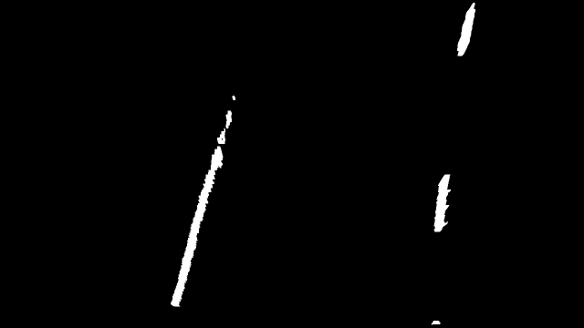

# **Advanced lane finding project**

# Summary

The steps of this project are the following:

* Computation the camera calibration matrix and distortion coefficients from a set of chessboard images.
* Undistortion of raw images
* Image segmentation using colors and edge detection
* Application of perspective transformation to bird's eye view
* Detection of lane pixels and fit to find the lane boundary.
* Determination the curvature of the lane and vehicle position with respect to center.
* Warping the detected lane boundaries back onto the original image.
* Output visual display of the lane boundaries and numerical estimation of lane curvature and vehicle position.
* Processing of videos

# Camera Calibration

## Computation of the camera matrix and distortion coefficients

The camera calibration is done in the class CalibrateCamera in CameraCalibration.py.
To do the calibration, images of chess boards with size (9, 6) are made from different camera positions. These are fed to the OpenCV algorithm `findChessboardCorners()` which finds the corners of the chess board and returns the coordinates in the camera coordinate system.
The world coordinate system is centered at the top left of the chess board and the z coordinates are assumed as zero. Since the chess board size is not know the size of one square is assumed to be 1.0. The length units of the result is then the length of one square.
To calculate the intrinsic camera parameters and the distortion coefficients the OpenCV function `calibrateCamera()` is used. It's called with a list ob objectpoints which is are the chess board corners in the world coodinate system described above and the image points in the camera coordinate system.
The result are the wanted parameters and the rotation and extrinsic parameters which are not used for our purposes.

With the parameters a quick check is done by undistorting one of the images with the OpenCV function `undistort()` and the result is checked:

Right: image with distortions and detected corner
Left: undistorted image

# Detection pipeline

## Visualization of the pipeline

## Image segmentation

Base image

### Canny edge detection

Canny edge detection calculates very thin edges. So the edges are dilatated to fit better to the color segmentation.

### Color segmentation

Since the left lines are always yellow and the right lanes are always white in the videos used they are also segmented for the corresponding colors. This helped in the harder challenge to reduce reflections from the window.

Combined segmentation:

Both segmentations were combined using the 'and' operator.

## Perspective transformation

The matrices for the perspective transformation were calculated using the OpenCV function `getPerspectiveTransform()`. The source and destination points needed for this algorithm were achieved by manually finding points in an camera image which shows a straight lane. Points from the region which should be used for the lane detection were choosen from the left and right lane mark at the bottom and the top.
Corresponding destination points were choosen by setting the x position for both points on the left and for both points on the right lane mark to the same value.

Since the camera and it's position don't changes in the videos these parameters were hard coded.

This resulted in the following source and destination points:

| Source        | Destination   | 
|:-------------:|:-------------:| 
| 283, 664      | 300, 690      | 
| 548, 480      | 300, 0        |
| 736, 480      | 1002, 0       |
| 1019, 664     | 1002, 690     |

To verify this transformation the source points were connected with lines which were transformed with the resulting matrix. The warped lines and the lane marks were straight as expected:

An additional example with the original distorted image and the segmented and warped image of the lane marks with curvature.

Original image:

Segmented and warped to birds eye view:

## Fit the lane lines with a polynomial

## Calculate the lane curvature and the vehicle position

## Result of the pipeline

# Pipeline on video

## Video processed by the pipeline

[Project video](./processed_videos/project_video.mp4)

[Challenge video](./processed_videos/challenge_video.mp4)

---

### Discussion

#### 1. Briefly discuss any problems / issues you faced in your implementation of this project.  Where will your pipeline likely fail?  What could you do to make it more robust?

Here I'll talk about the approach I took, what techniques I used, what worked and why, where the pipeline might fail and how I might improve it if I were going to pursue this project further.  

### Harder challenge:

tried:
- splines
- different low pass filtering
- parameter optimization for image segmentation