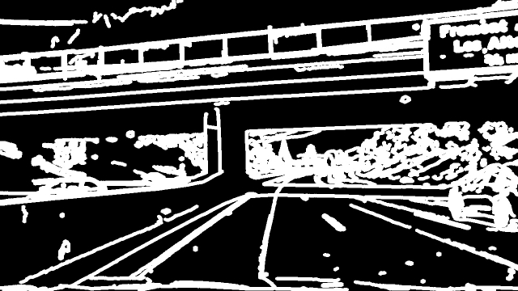

# Early draft from template
## Writeup Template

### You can use this file as a template for your writeup if you want to submit it as a markdown file, but feel free to use some other method and submit a pdf if you prefer.

---

**Advanced Lane Finding Project**

The goals / steps of this project are the following:

* Computation the camera calibration matrix and distortion coefficients from a set of chessboard images.
* Undistortion of raw images
* Image segmentation using colors and edge detection
* Application of perspective transformation to bird's eye view
* Detection of lane pixels and fit to find the lane boundary.
* Determination the curvature of the lane and vehicle position with respect to center.
* Warping the detected lane boundaries back onto the original image.
* Output visual display of the lane boundaries and numerical estimation of lane curvature and vehicle position.
* Processing of videos

[//]: # (Image References)

[img_dist]: docu_images/calibration2.jpg "Original"
[img_undist]: docu_images/calibration2_undist.jpg "Undistorted"

[img_original]: docu_images/image0110_challenge_original.jpg "Original"
[img_chundist]: docu_images/image0110_challenge_undist.jpg "Undistorted"
[img_seg_bird]: docu_images/image0110_challenge_seg_bird.jpg "Segmented birds eye"
[img_seg_canny]: docu_images/image0110_challenge_seg_canny.jpg "Segmented canny"
[img_seg_color]: docu_images/image0110_challenge_seg_color.jpg "Segmented color"
[img_seg_combined]: docu_images/image0110_challenge_seg_combined.jpg "Segmented combined"

[img_tranf_point]: docu_images/transformationPointsOriginal.png ""
[img_tranf_point_warped]: docu_images/transformationPointsWarped.png ""

[image1]: ./examples/undistort_output.png "Undistorted"
[image2]: ./test_images/test1.jpg "Road Transformed"
[image3]: ./examples/binary_combo_example.jpg "Binary Example"
[image4]: ./examples/warped_straight_lines.jpg "Warp Example"
[image5]: ./examples/color_fit_lines.jpg "Fit Visual"
[image6]: ./examples/example_output.jpg "Output"
[video1]: ./project_video.mp4 "Video"

# Camera Calibration

## Computation of the camera matrix and distortion coefficients

The camera calibration is done in the class CalibrateCamera in CameraCalibration.py.
To do the calibration, images of chess boards with size (9, 6) are made from different camera positions. These are fed to the OpenCV algorithm `findChessboardCorners()` which finds the corners of the chess board and returns the coordinates in the camera coordinate system.
The world coordinate system is centered at the top left of the chess board and the z coordinates are assumed as zero. Since the chess board size is not know the size of one square is assumed to be 1.0. The length units of the result is then the length of one square.
To calculate the intrinsic camera parameters and the distortion coefficients the OpenCV function `calibrateCamera()` is used. It's called with a list ob objectpoints which is are the chess board corners in the world coodinate system described above and the image points in the camera coordinate system.
The result are the wanted parameters and the rotation and extrinsic parameters which are not used for our purposes.

With the parameters a quick check is done by undistorting one of the images with the OpenCV function `undistort()` and the result is checked:

Right: image with distortions and detected corner
Left: undistorted image

# Detection pipeline

## Visualization of the pipeline

Original:

![alt text][img_original]

Segmentation warped to birds eye view

![alt text][img_seg_bird]

## Image segmentation

Base image

{: style="max-width: 500px; height: auto;"}

### Canny edge detection

Canny edge detection calculates very thin edges. So the edges are dilatated to fit better to the color segmentation.

### Color segmentation

Since the left lines are always yellow and the right lanes are always white in the videos used they are also segmented for the corresponding colors. This helped in the harder challenge to reduce reflections from the window.

Combined segmentation:

Both segmentations were combined using the 'and' operator.

## Perspective transformation

The code for my perspective transform includes a function called `warper()`, which appears in lines 1 through 8 in the file `example.py` (output_images/examples/example.py) (or, for example, in the 3rd code cell of the IPython notebook).  The `warper()` function takes as inputs an image (`img`), as well as source (`src`) and destination (`dst`) points.  I chose the hardcode the source and destination points in the following manner:

This resulted in the following source and destination points:

| Source        | Destination   | 
|:-------------:|:-------------:| 
| 283, 664      | 300, 690      | 
| 548, 480      | 300, 0        |
| 736, 480      | 1002, 0       |
| 1019, 664     | 1002, 690     |

I verified that my perspective transform was working as expected by drawing the `src` and `dst` points onto a test image and its warped counterpart to verify that the lines appear parallel in the warped image.

![alt text][img_tranf_point]
![alt text][img_tranf_point_warped]

#### 4. Describe how (and identify where in your code) you identified lane-line pixels and fit their positions with a polynomial?

Then I did some other stuff and fit my lane lines with a 2nd order polynomial kinda like this:

![alt text][image5]

#### 5. Describe how (and identify where in your code) you calculated the radius of curvature of the lane and the position of the vehicle with respect to center.

I did this in lines # through # in my code in `my_other_file.py`

#### 6. Provide an example image of your result plotted back down onto the road such that the lane area is identified clearly.

I implemented this step in lines # through # in my code in `yet_another_file.py` in the function `map_lane()`.  Here is an example of my result on a test image:

![alt text][image6]

---

# Pipeline (video)

## Video processed by the pipeline

[Challenge video](./challenge_video.mp4)

---

### Discussion

#### 1. Briefly discuss any problems / issues you faced in your implementation of this project.  Where will your pipeline likely fail?  What could you do to make it more robust?

Here I'll talk about the approach I took, what techniques I used, what worked and why, where the pipeline might fail and how I might improve it if I were going to pursue this project further.  

### Harder challenge:

tried:
- splines
- different low pass filtering
- parameter optimization for image segmentation